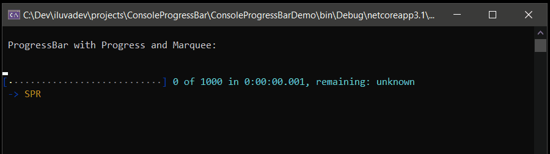
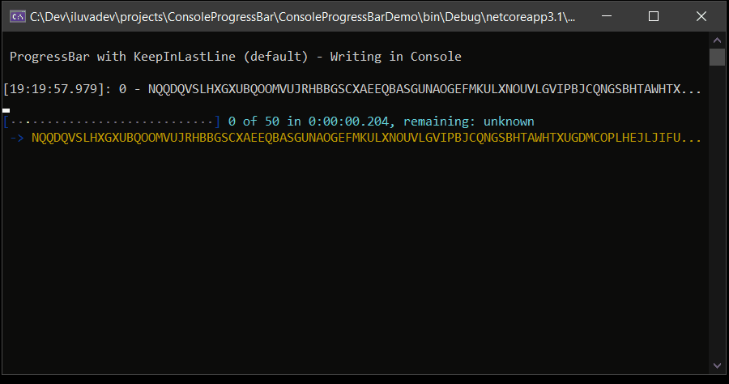

# ConsoleProgressBar
A ProgressBar for Console, in C# 
It needs only a file: ConsoleProgressBar.cs
(Readme under construction)


Code:
```csharp
using (var pg = new ProgressBar() { Maximum = 1000 }) //Create the ProgressBar
{
  for (int i = 0; i < 1000; i++)  //Iterate over elements
  {
    //Assign Current element Name
    pg.CurrentElementName = elementName[i];
		
    Task.Delay(20).Wait();  //Do something
		
    //PerformStep in ProgressBar
    pg.PerformStep();
  }
}
```
 
 
Code:
```csharp
using (var pg = new ProgressBar() { Maximum = 50 }) //Create the ProgressBar
{
  for (int i = 0; i < 50; i++)  //Iterate over elements
  {
    //Assign Current element Name
    pg.CurrentElementName = elementName[i];
    
    //Lock Console for Writing
    lock (ProgressBar.ConsoleWriterLock)
    {
      //Write over the ProgressBar
      //Adapt Text to Console width with 'ProgressBar.AdaptTextToMaxWidth'
      Console.WriteLine(ProgressBar.AdaptTextToMaxWidth($"[{DateTime.Now.ToString("HH:mm:ss.fff")}]: {i} - {elementName}", Console.BufferWidth));
    }	
    Task.Delay(250).Wait();  //Do something
		
    //PerformStep in ProgressBar
    pg.PerformStep();
  }
}
```
