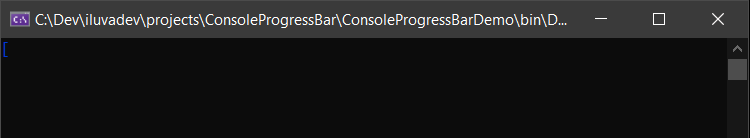

[***Readme under construction***]

# ConsoleProgressBar
A versatile and easy to use ProgressBar for Console applications, written in C#. 

Is **.Net Standard 2.1** (cross-platform ready), but only tested on Windows.

## Features
* Simple to use with many configuration options
* Can show or hide a *Marquee*: a char that moves around the ProgressBar
* Maximum is optional: If `Maximum` is `null`, no progress will be shown (but you can show Marquee)
* Automatically calculates `Percentage` and *Estimated Remaining Time* (`TimeRemaining`)
* Optional `Text` in the same line as ProgressBar 
* Optional multiple `Descriptions` under ProgressBar
* Colors in all components: in ProgressBar `Layout` elements, in `Text` and `Descriptions`

You can define dynamic content or values, with lambda expressions for:
* Background and Foreground Colors of `Layout` elements, `Text` and `Descriptions`
* Content of `Text` and `Descriptions`
* Characters used in `Layout` to represent ProgressBar

### How it works
ProgressBar creates an internal Thread. In this thread the component updates its representation in Console every few time.
This time is configurable, modifying the ``Delay`` property (default: 75ms)


## Examples in images
Default ProgressBar:



Writing on Console:


Styling ProgressBar:


## Install


## Usage
You can configure a lot of things, but usage is very simple:
```csharp
const int max = 500;

//Create the ProgressBar
using (var pb = new ProgressBar{ Maximum = max })
{
    for (int i = 0; i < max; i++)
    {
        Task.Delay(50).Wait(); //Do something
        pb.PerformStep(); //Step in ProgressBar (Default is 1)
    }
}
```
And produces:


